# Lab 08 - Manage Virtual Machines


## Índice

- [Descripción del laboratorio](#descripción-del-laboratorio)  
- [Escenario del laboratorio](#escenario-del-laboratorio)  
- [Esquema Visual del Laboratorio](#esquema-visual-del-laboratorio)  
- [Habilidades adquiridas](#habilidades-adquiridas)  
- [Costo Total del Laboratorio](#costo-total-del-laboratorio)  
- [Desarrollo del laboratorio](#desarrollo-del-laboratorio)  
  - [Tarea 1: Implementar máquinas virtuales resilientes por zonas](#tarea-1-implementar-máquinas-virtuales-resilientes-por-zonas)  
  - [Tarea 2: Administrar escalado de cómputo y almacenamiento](#tarea-2-administrar-escalado-de-cómputo-y-almacenamiento)  
  - [Tarea 3: Crear y configurar conjuntos de escalado de máquinas virtuales](#tarea-3-crear-y-configurar-conjuntos-de-escalado-de-máquinas-virtuales)  
  - [Tarea 4: Escalar conjuntos de máquinas virtuales](#tarea-4-escalar-conjuntos-de-máquinas-virtuales)  
  - [Tarea 5: Crear una máquina virtual con PowerShell](#tarea-5-crear-una-máquina-virtual-con-powershell)  
  - [Tarea 6: Crear una máquina virtual con CLI](#tarea-6-crear-una-máquina-virtual-con-cli)  
- [Conceptos reforzados](#conceptos-reforzados)  
- [Resultados esperados](#resultados-esperados)  
- [Limpieza de recursos](#limpieza-de-recursos)  
- [Contribuciones](#contribuciones)  
- [Licencia](#licencia)  

---

## Descripción del laboratorio

En este laboratorio exploramos de manera práctica y comparativa las distintas formas de administrar **máquinas virtuales en Azure**, abordando tanto el despliegue de instancias individuales como el uso de **Virtual Machine Scale Sets (VMSS)** para escenarios de escalado automático. Los laboratorios oficiales se encuentran disponibles en: [Microsoft Learning Labs AZ-104](https://microsoftlearning.github.io/AZ-104-MicrosoftAzureAdministrator/).

A lo largo de las tareas, trabajaremos con conceptos clave de alta disponibilidad y resiliencia, implementando máquinas virtuales distribuidas en **zonas de disponibilidad** para garantizar un SLA de hasta el 99.99%. También profundizaremos en el **escalado vertical**, ajustando el tamaño de las VMs y optimizando discos para mejorar rendimiento y costos.

Posteriormente, avanzaremos hacia el **escalado horizontal** mediante VMSS, configurando reglas de autoscaling basadas en métricas de CPU y estableciendo límites de instancias para controlar el consumo de recursos. Este enfoque permite automatizar la respuesta a la demanda de carga, reduciendo la intervención manual y mejorando la eficiencia operativa.

Además, reforzamos las habilidades de automatización utilizando **Azure PowerShell** y **Azure CLI**, dos herramientas fundamentales para administradores que buscan rapidez y consistencia en la gestión de recursos. Estas prácticas nos permiten comprender cómo integrar scripts y comandos en flujos de trabajo reales.

En conjunto, este laboratorio nos prepara para enfrentar escenarios corporativos donde la **resiliencia, escalabilidad y optimización de costos** son esenciales, brindando una visión completa de las capacidades de Azure para administrar infraestructura virtual de manera segura, flexible y eficiente.

---

## Escenario del laboratorio

La organización desea explorar las distintas formas de desplegar y administrar **máquinas virtuales en Azure**, evaluando tanto la simplicidad de instancias individuales como la eficiencia de los **conjuntos de escalado (VM Scale Sets)**.  

En una primera fase, se implementa una máquina virtual con **escalado manual**, lo que permite comprender cómo ajustar recursos de cómputo y almacenamiento de manera vertical (cambiando SKU o discos) según las necesidades puntuales de rendimiento. Este enfoque resulta útil en escenarios donde la carga de trabajo es predecible y se requiere control directo sobre la infraestructura.  

Posteriormente, se avanza hacia la creación de un **Virtual Machine Scale Set**, que introduce el concepto de **escalado automático basado en métricas**. Aquí se configuran reglas que permiten aumentar o reducir el número de instancias de manera dinámica, respondiendo a la demanda real de CPU o tráfico. Este modelo refleja situaciones corporativas donde la carga de trabajo es variable y se necesita garantizar disponibilidad sin intervención manual constante.  

El laboratorio también incluye tareas opcionales con **PowerShell y CLI**, reforzando la importancia de la automatización en entornos de nube. Estas herramientas permiten a los administradores ejecutar despliegues rápidos y consistentes, integrando scripts en procesos de operación y mantenimiento.  

En conjunto, el escenario plantea un recorrido completo: desde la creación de VMs resilientes en zonas de disponibilidad, pasando por el escalado vertical, hasta la implementación de VMSS con balanceo de carga y autoscaling. Esto nos prepara para enfrentar entornos reales donde la **resiliencia, escalabilidad y optimización de costos** son factores críticos en la administración de infraestructura en Azure.

---

## Esquema Visual del Laboratorio

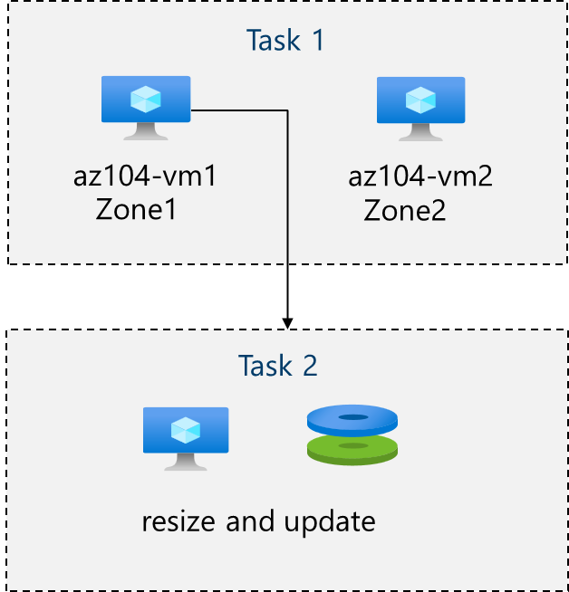
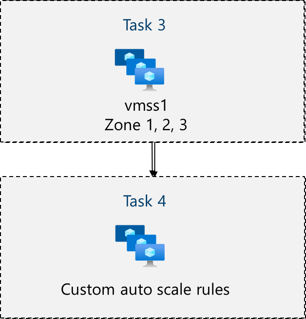

---

## Habilidades adquiridas

- Tarea 1: Implementar máquinas virtuales de Azure resilientes por zonas utilizando el portal de Azure.
- Tarea 2: Administrar el escalado de cómputo y almacenamiento para máquinas virtuales.
- Tarea 3: Crear y configurar conjuntos de escalado de máquinas virtuales (Virtual Machine Scale Sets).
- Tarea 4: Escalar conjuntos de máquinas virtuales (Virtual Machine Scale Sets).
- Tarea 5: Crear una máquina virtual utilizando Azure PowerShell (opcional 1).
- Tarea 6: Crear una máquina virtual utilizando la CLI (opcional 2).

---

## Costo Total del Laboratorio

El costo depende de la región (*East US*) y los recursos desplegados:

| Recurso | Configuración | Costo aproximado |
|---------|---------------|------------------|
| 2 VMs Standard D2s_v3 | Windows Server 2025, Premium SSD | ~0.42 USD/hora cada VM |
| VMSS con 2 instancias | Standard D2s_v3 + Load Balancer | ~0.20 USD/hora |
| Discos adicionales | Standard SSD 32 GiB | ~0.005 USD/hora |
| Balanceador de carga | Público básico | ~0.018 USD/hora |

**Total estimado:**  

- **~0.50–0.65 USD/hora** (ejecución puntual del laboratorio).  
- **~320–360 USD/mes** si los recursos permanecen activos todo el mes.  

> ⚠️ Estos valores provienen de la **Azure Pricing Calculator (abril 2026)** y pueden variar según la región y redundancia seleccionada.

---

## Desarrollo del laboratorio

### Tarea 1: Implementar máquinas virtuales resilientes por zonas

En esta tarea desplegaremos dos máquinas virtuales de Azure en diferentes zonas de disponibilidad utilizando el portal de Azure.  
Las zonas de disponibilidad ofrecen el mayor nivel de SLA de tiempo de actividad para máquinas virtuales: **99.99%**.  
Para lograr este SLA, debemos desplegar al menos dos máquinas virtuales en diferentes zonas de disponibilidad.

1. Iniciamos sesión en el portal de Azure: [https://portal.azure.com](https://portal.azure.com).  
2. Buscamos y seleccionamos **Virtual machines**. En el panel de Virtual machines, hacemos clic en **+ Create** y luego seleccionamos **Azure virtual machine** en el menú desplegable. Observamos las otras opciones disponibles.  
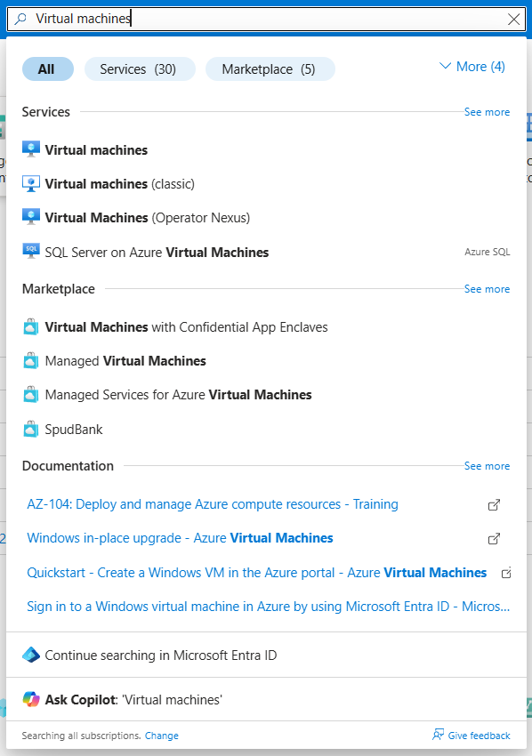
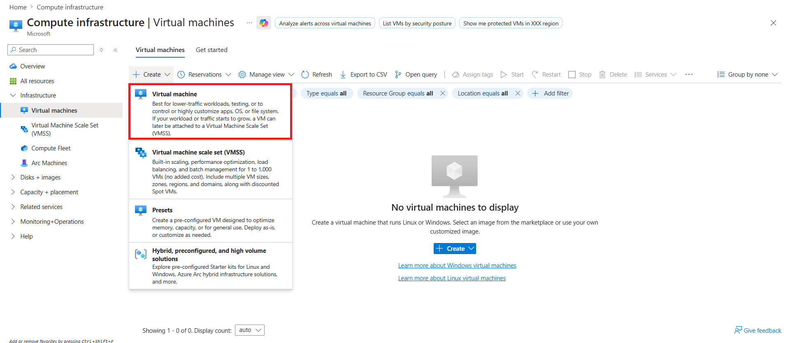

3. En la pestaña **Basics**, en el menú desplegable **Availability zone**, marcamos la casilla junto a **Zone 2**. Esto seleccionará tanto la Zona 1 como la Zona 2.
    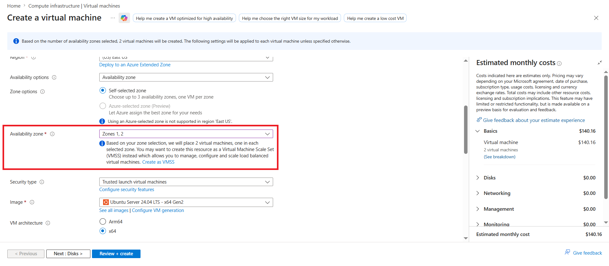

    >**Nota:**
    >
    > Esto desplegará dos máquinas virtuales en la región seleccionada, una en cada zona. Se logra el SLA de 99.99% porque hay al menos dos VMs distribuidas en dos zonas. Incluso si solo necesitamos una VM, es buena práctica desplegarla en otra zona.

4. En la pestaña **Basics**, completamos la configuración con los siguientes valores:  
   - **Subscription:** nombre de tu suscripción de Azure  
   - **Resource group:** `az104-rg8` (si es necesario, hacemos clic en *Create new*)  
   - **Virtual machine names:** `az104-vm1` y `az104-vm2` (tras seleccionar ambas zonas, usamos *Edit names* bajo el campo de nombre de VM)
   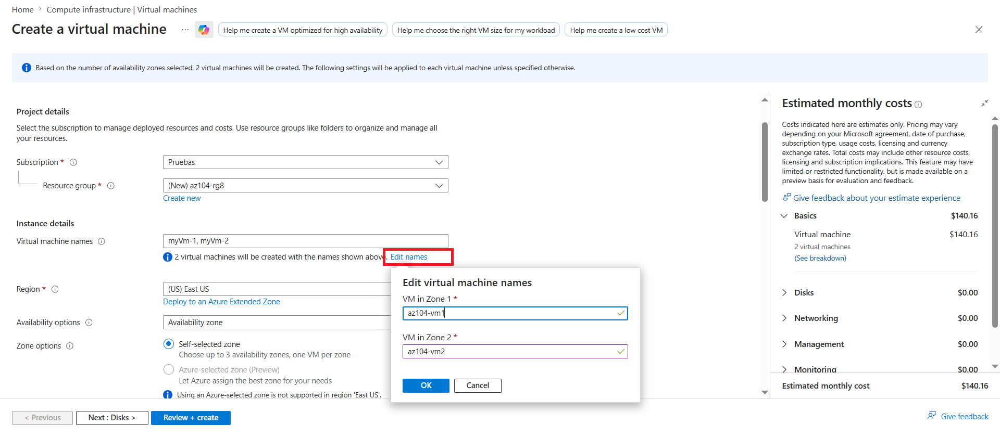

   - **Region:** East US
   - **Availability options:** Availability zone  
   - **Availability zone:** Zone 1, Zone 2  
   - **Security type:** Standard  
   - **Image:** Windows Server 2025 Datacenter - x64 Gen2  
   - **Azure Spot instance:** desmarcado  
   - **Size:** Standard D2s v3 **(Cambiar Region si no hay disponibilidad de tamaños)**
   - **Username:** localadmin  
   - **Password:** proporcionamos una contraseña segura  
   - **Public inbound ports:** None  
   - **¿Usar licencia existente de Windows Server?:** desmarcado  
    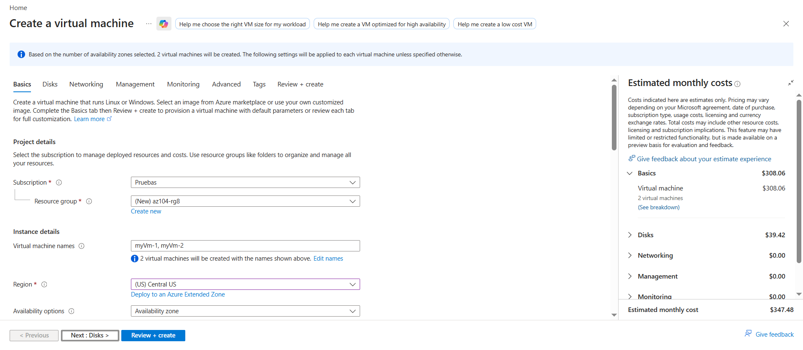

5. Hacemos clic en **Next : Disks >** y especificamos:
    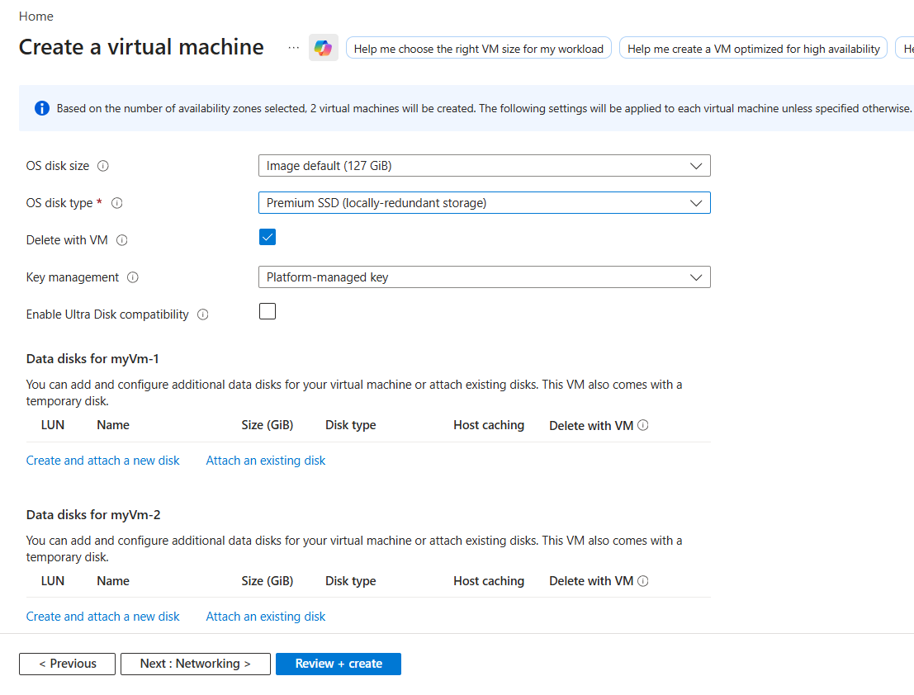
   - **OS disk type:** Premium SSD  
   - **Delete with VM:** marcado (por defecto)  
   - **Enable Ultra Disk compatibility:** desmarcado

6. Hacemos clic en **Next : Networking >** y dejamos los valores por defecto, pero no configuramos un balanceador de carga.  
   - **Delete public IP and NIC when VM is deleted:** marcado  
   - **Load balancing options:** None
   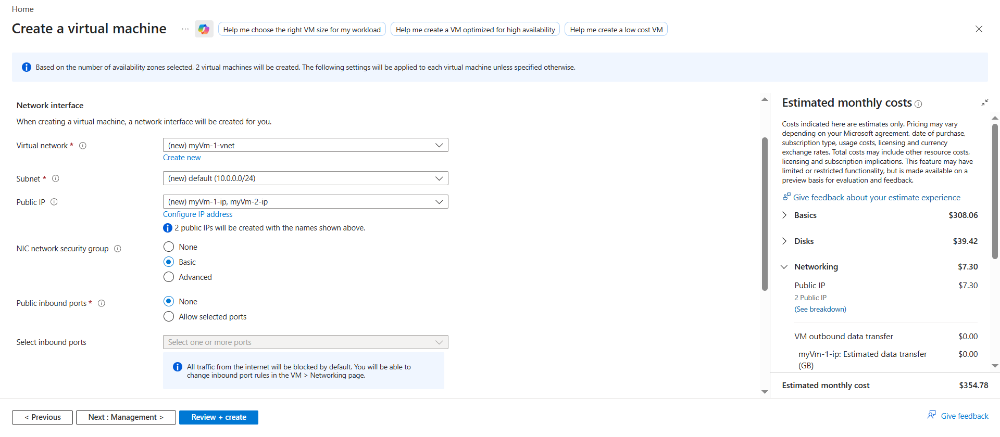

7. Hacemos clic en **Next : Management >** y revisamos la configuración sin realizar cambios.  

8. Hacemos clic en **Next : Monitoring >** y especificamos:  
   - **Boot diagnostics:** Disable  

9. Hacemos clic en **Next : Advanced >**, dejamos los valores por defecto y luego seleccionamos **Review + Create**.  

10. Tras la validación, hacemos clic en **Create**.
    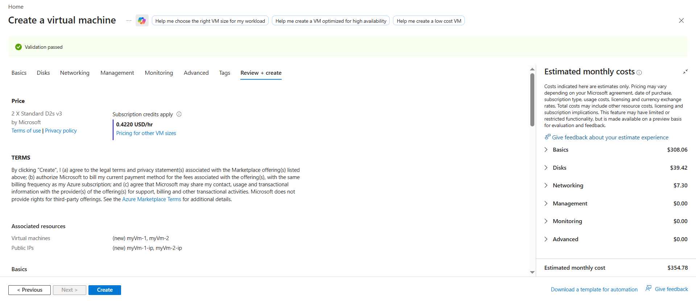
    - **Nota:** Durante el despliegue, observamos que la NIC, el disco y la dirección IP pública (si se configuró) se crean y administran como recursos independientes.  

11. Esperamos a que finalice el despliegue y seleccionamos **Go to resource**.
    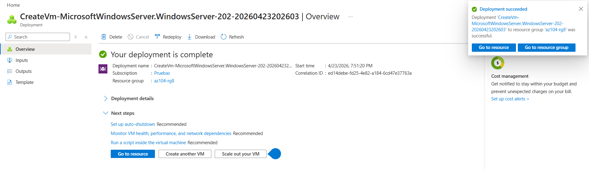
    - **Nota:** Monitoreamos los mensajes de notificación para verificar el progreso.  


---

### Tarea 2: Administrar escalado de cómputo y almacenamiento

En esta tarea escalamos una máquina virtual ajustando su tamaño a un SKU diferente.  
Azure ofrece flexibilidad en la selección de tamaños de VM, lo que nos permite asignar más (o menos) recursos de cómputo y memoria según las necesidades. Este concepto también se aplica a los discos, donde podemos modificar el rendimiento o aumentar la capacidad asignada.

1. En la máquina virtual **az104-vm1**, en el panel **Availability + scale**, seleccionamos **Size**.
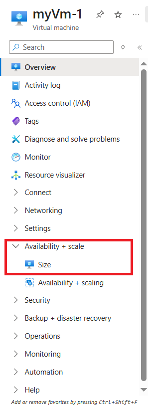

2. Configuramos el tamaño de la máquina virtual a **D2ds_v4** y hacemos clic en **Resize**. Cuando se nos solicite, confirmamos el cambio.  
   - **Nota:** Si **D2ds_v4** no está disponible, elegimos otro tamaño. Este proceso se conoce como **escalado vertical**, hacia arriba o hacia abajo.
   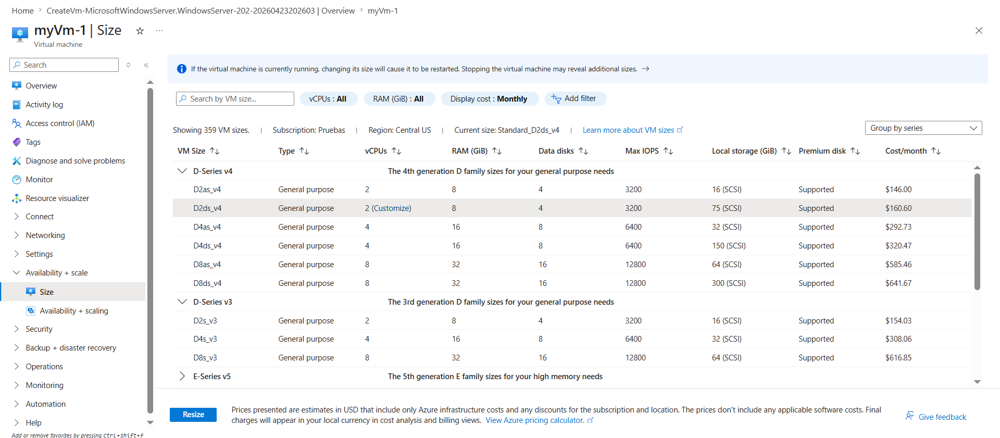

3. En el área **Settings**, seleccionamos **Disks**.  
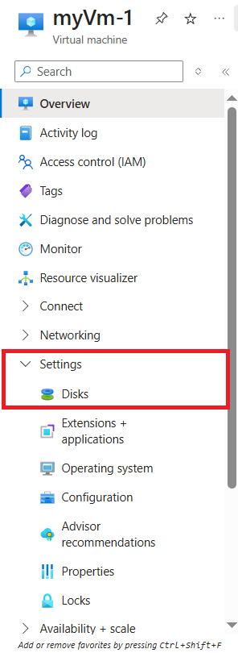

4. En la sección **Data disks**, seleccionamos **+ Create and attach a new disk** y configuramos los siguientes valores (dejamos los demás por defecto):
   - **Disk name:** `vm1-disk1`  
   - **Storage type:** Standard HDD  
   - **Size (GiB):** 32  
   - Luego hacemos clic en **Apply**.  
    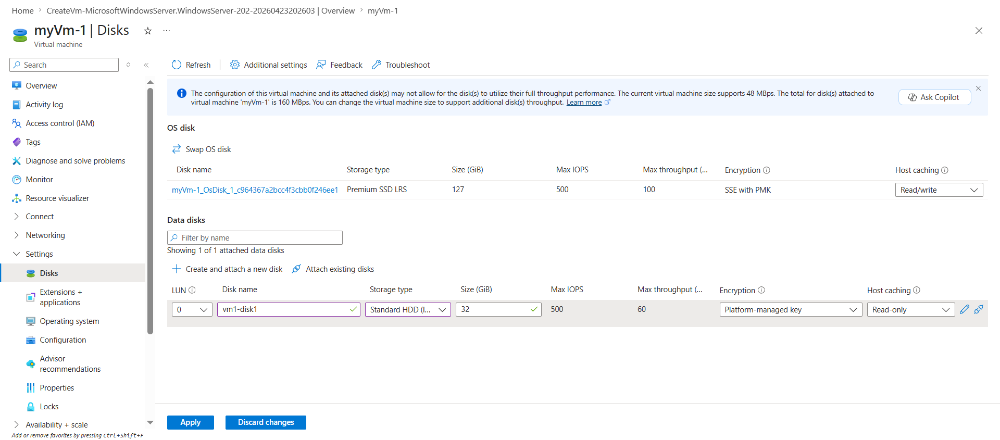

5. Una vez creado el disco, hacemos clic en **Detach** (si es necesario, desplazamos hacia la derecha para ver el ícono de detach) y luego en **Apply**.
    
   - **Nota:** Al separar el disco de la VM, este se mantiene en almacenamiento para uso posterior.
    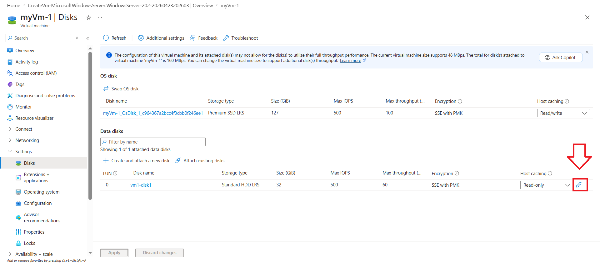

6. Buscamos y seleccionamos **Disks**. De la lista de discos, seleccionamos el objeto **vm1-disk1**.
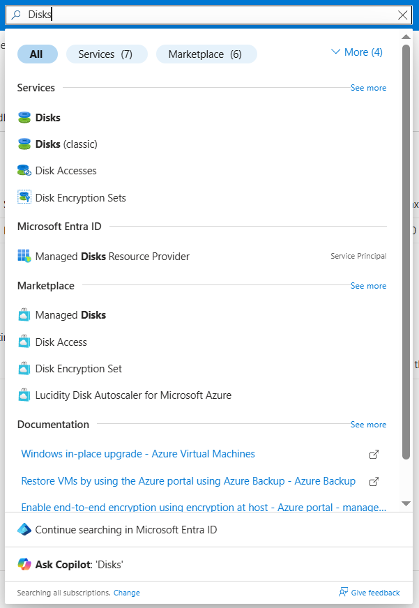
   - **Nota:** El panel **Overview** también muestra información de rendimiento y uso del disco.
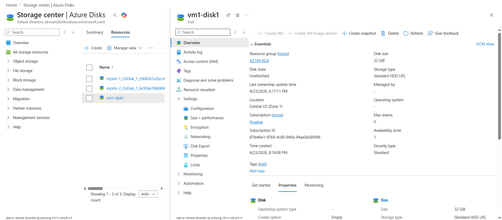

7. En el panel **Settings**, seleccionamos **Size + performance**.
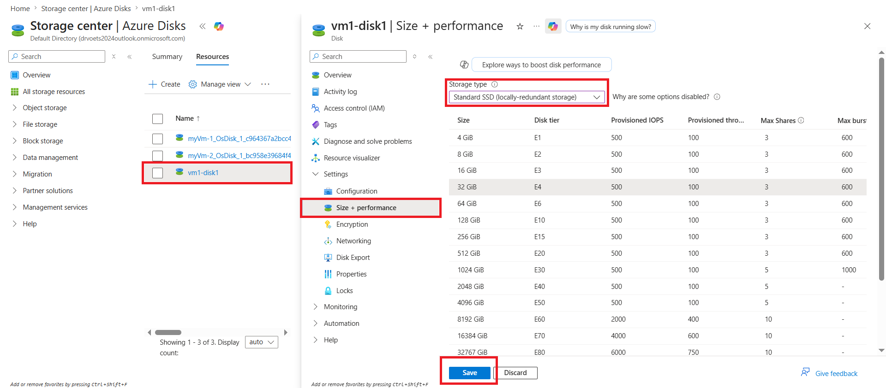

8. Configuramos el tipo de almacenamiento a **Standard SSD** y hacemos clic en **Save**.
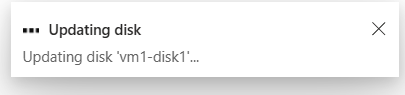
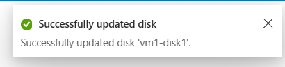

9. Regresamos a la máquina virtual **az104-vm1** y seleccionamos **Disks**.  
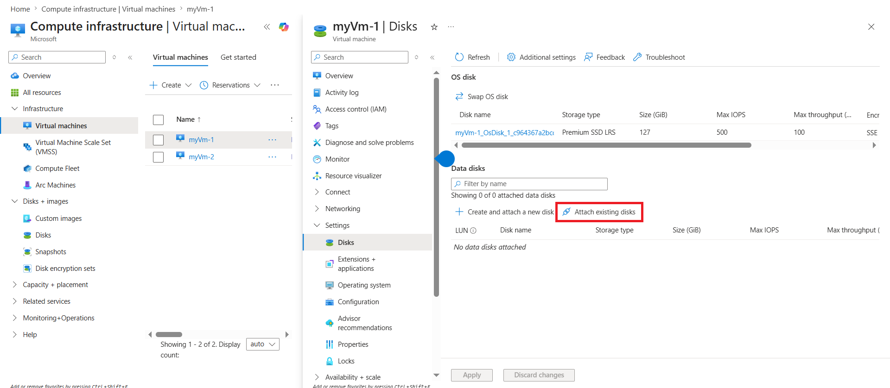

10. En la sección **Data disk**, seleccionamos **Attach existing disks**.  

11. En el menú desplegable **Disk name**, seleccionamos **VM1-DISK1**.  
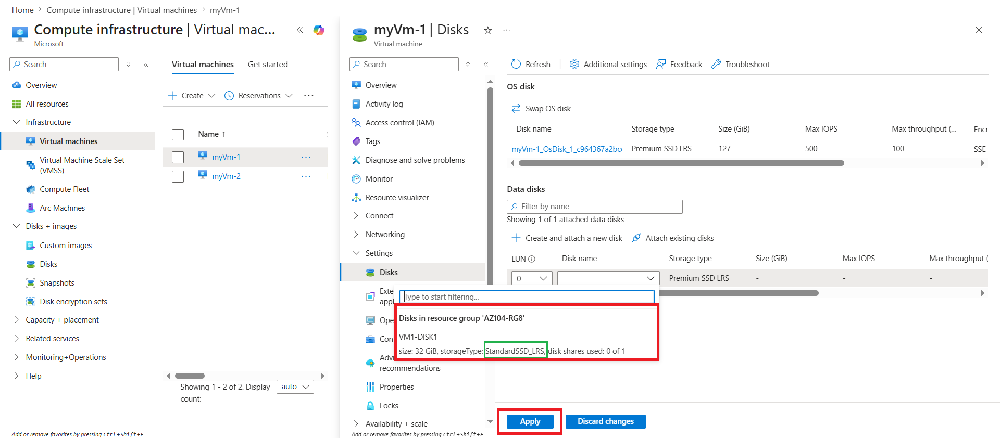

12. Verificamos que el disco ahora sea **Standard SSD**.  

13. Seleccionamos **Apply** para guardar los cambios.  

**Nota final:** En esta tarea hemos creado una máquina virtual, escalado su SKU y ajustado el tamaño y tipo de disco. En la siguiente tarea utilizaremos **Virtual Machine Scale Sets** para automatizar el proceso de escalado.

---

### Tarea 3: Crear y configurar conjuntos de escalado de máquinas virtuales

En esta tarea desplegamos un conjunto de escalado de máquinas virtuales (VMSS) en varias zonas de disponibilidad.  
Los VMSS reducen la carga administrativa de la automatización al permitirnos configurar métricas o condiciones que hacen que el conjunto escale horizontalmente (scale in o scale out).

1. En el portal de Azure, buscamos y seleccionamos **Virtual machine scale sets** y, en el panel de Virtual machine scale sets, hacemos clic en **+ Create**.
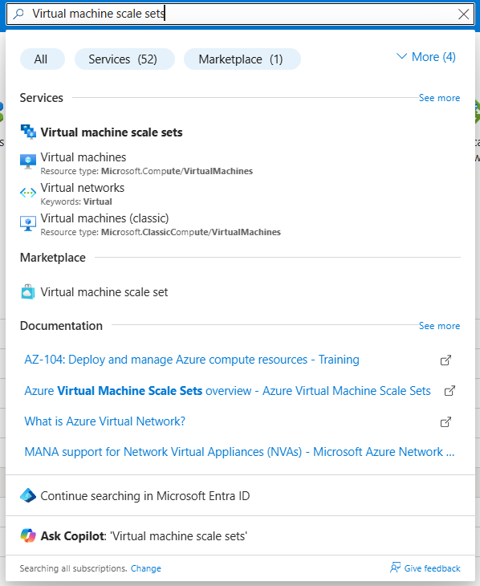
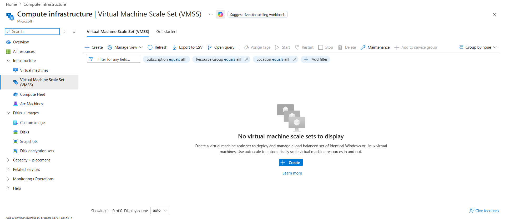

2. En la pestaña **Basics** de la ventana *Create a virtual machine scale set*, especificamos los siguientes valores (dejamos los demás por defecto) y hacemos clic en **Next : Spot >**:  

   - **Subscription:** nombre de nuestra suscripción de Azure  
   - **Resource group:** `az104-rg8`  
   - **Virtual machine scale set name:** `vmss1`  
   - **Region:** East US  
   - **Availability zone:** Zones 1, 2, 3  
   - **Orchestration mode:** Uniform  
   - **Security type:** Standard  
   - **Scaling options:** dejamos los valores por defecto (los cambiaremos en la siguiente tarea)  
   - **Image:** Windows Server 2025 Datacenter - x64 Gen2  
   - **Run with Azure Spot discount:** desmarcado  
   - **Size:** Standard D2s_v3  
   - **Username:** localadmin  
   - **Password:** proporcionamos una contraseña segura  
   - **Already have a Windows Server license?:** desmarcado  
   - **Nota:** Para la lista de regiones de Azure que soportan despliegue de VMs en zonas de disponibilidad, consultar *What are Availability Zones in Azure*.  

3. En la pestaña **Spot**, aceptamos los valores por defecto y seleccionamos **Next : Disks >**.  
4. En la pestaña **Disks**, aceptamos los valores por defecto y hacemos clic en **Next : Networking >**.  
5. En la página **Networking**, seleccionamos **Edit virtual network link** y realizamos los siguientes cambios:

   - **Name:** `vmss-vnet`  
   - **Address range:** `10.82.0.0/20` (eliminamos el rango existente)  
   - **Subnet name:** `subnet0`  
   - **Subnet range:** `10.82.0.0/24`  
   Luego hacemos clic en **OK**.  
   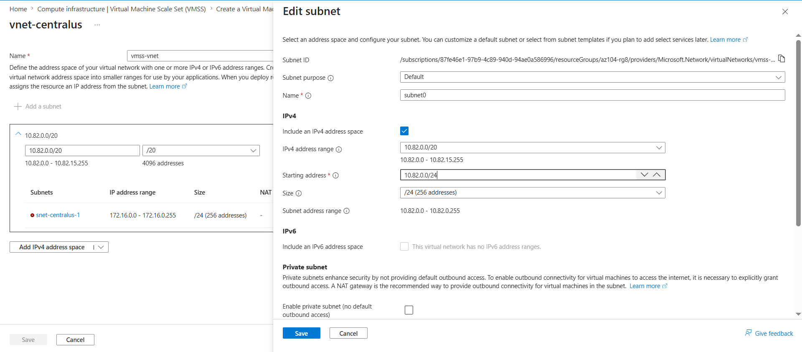

6. En la pestaña **Networking**, hacemos clic en el ícono **Edit network interface** a la derecha de la entrada de interfaz de red.
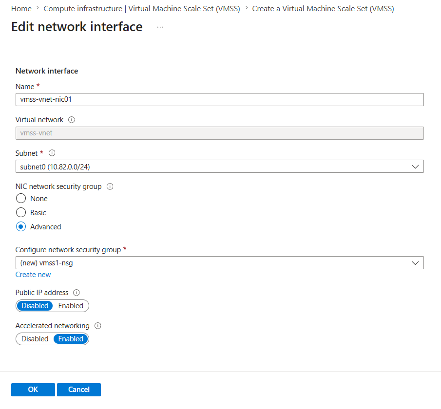

7. En la sección **NIC network security group**, seleccionamos **Advanced** y luego hacemos clic en **Create new** bajo el menú desplegable *Configure network security group*.
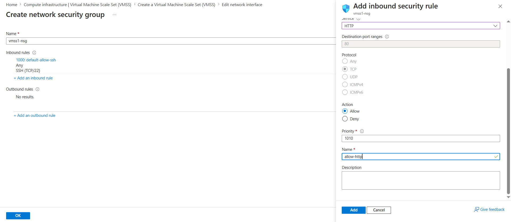

8. En la ventana *Create network security group*, especificamos:

   - **Name:** `vmss1-nsg`  
   Luego agregamos una regla de seguridad entrante con los siguientes valores:  
   - **Source:** Any  
   - **Source port ranges:** *  
   - **Destination:** Any  
   - **Service:** HTTP  
   - **Action:** Allow  
   - **Priority:** 1010  
   - **Name:** `allow-http`  
   Hacemos clic en **Add** y luego en **OK**.  

9. En la ventana *Edit network interface*, en la sección **Public IP address**, habilitamos la opción y hacemos clic en **OK**.  

10. En la pestaña **Networking**, en la sección **Load balancing**, configuramos:  

    - **Load balancing options:** Azure load balancer  
    - **Select a load balancer:** Create a load balancer  

    En la ventana *Create a load balancer*, especificamos:  
    - **Load balancer name:** `vmss-lb`  
    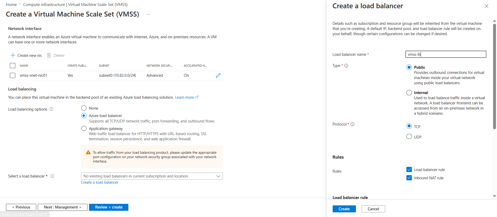

    Dejamos los demás valores por defecto y hacemos clic en **Create**.  
    Luego seleccionamos **Next : Management >**.  

11. En la pestaña **Management**, configuramos:  
    - **Boot diagnostics:** Disable  
    Luego hacemos clic en **Next : Health >**.  

12. En la pestaña **Health**, revisamos los valores por defecto sin realizar cambios y hacemos clic en **Next : Advanced >**.  

13. En la pestaña **Advanced**, hacemos clic en **Review + create**.  

14. En la pestaña **Review + create**, verificamos que la validación haya pasado y hacemos clic en **Create**.  

    - **Nota:** Esperamos a que el despliegue del VMSS se complete (aprox. 5 minutos). Mientras tanto, revisamos la documentación.
    [VMSS](./images/33.png)
    [VMSS](./images/34.png)

**Nota final:** En este punto hemos configurado el conjunto de escalado de máquinas virtuales con discos y red. En la configuración de red creamos un grupo de seguridad (NSG) que permite tráfico HTTP y un balanceador de carga con dirección IP pública.

---

### Tarea 4: Escalar conjuntos de máquinas virtuales

En esta tarea escalamos el conjunto de máquinas virtuales utilizando una regla de escalado personalizada.

1. Seleccionamos **Go to resource** o buscamos y seleccionamos el conjunto de escalado **vmss1**. 
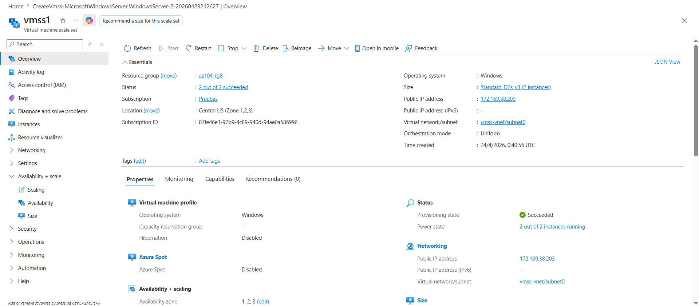

2. En el menú lateral, elegimos **Availability + Scale** y luego seleccionamos **Scaling**.  
   - **Nota:** Podemos usar **Manual scale** o **Custom autoscale**. En conjuntos con pocas instancias, aumentar o disminuir manualmente puede ser suficiente. En conjuntos con muchas instancias, el escalado basado en métricas es más apropiado.  

#### Regla de Scale Out (escalar hacia afuera)

1. Seleccionamos **Custom autoscale**.
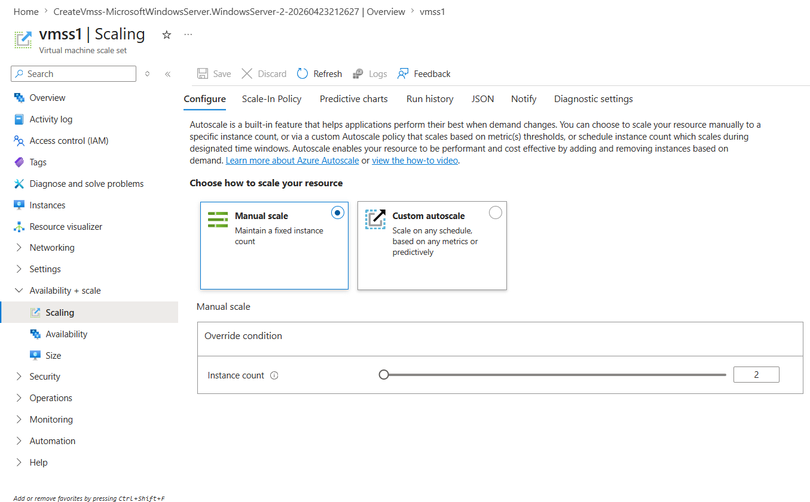

2. Cambiamos el modo de escalado a **Scale based on metric** y luego seleccionamos **Add a rule**.
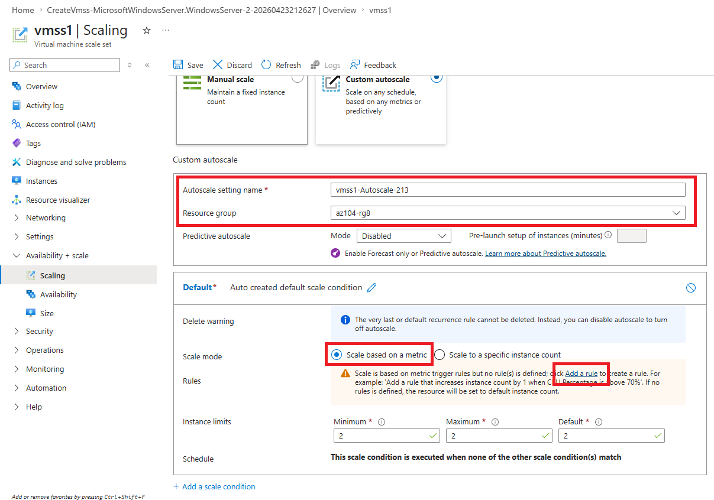

3. Configuramos la regla para aumentar automáticamente el número de instancias cuando la carga promedio de CPU sea mayor al 70% durante un período de 10 minutos.

   - **Metric source:** Current resource (vmss1)  
   - **Metric namespace:** Virtual Machine Host  
   - **Metric name:** Percentage CPU  
   - **Operator:** Greater than  
   - **Metric threshold:** 70  
   - **Duration (minutes):** 10  
   - **Time grain statistic:** Average  
   - **Operation:** Increase percent by  
   - **Cool down (minutes):** 5  
   - **Percentage:** 50  
    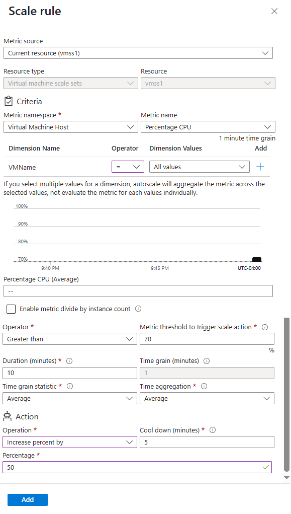

4. Guardamos los cambios.  

#### Regla de Scale In (escalar hacia adentro)

1. Creamos una regla para disminuir el número de instancias cuando la carga promedio de CPU sea menor al 30% durante un período de 10 minutos. 

   - **Operator:** Less than  
   - **Threshold:** 30  
   - **Operation:** Decrease percentage by  
   - **Percentage:** 50
    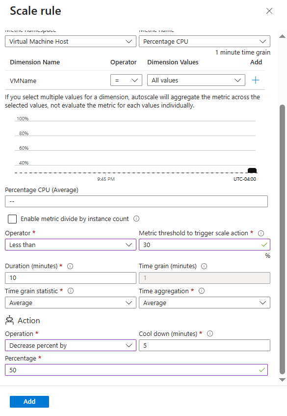

2. Guardamos los cambios.  

#### Límites de instancias

1. Configuramos los límites de instancias para asegurar que las reglas de autoscaling no excedan el máximo ni reduzcan por debajo del mínimo:

   - **Minimum:** 2  
   - **Maximum:** 10  
   - **Default:** 2  
    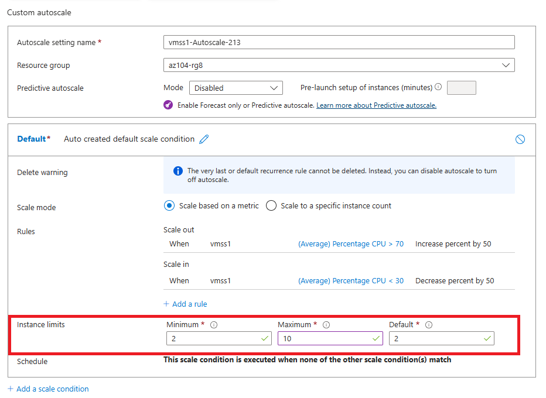

2. Guardamos los cambios.  

3. En la página de **vmss1**, seleccionamos **Instances**. Aquí monitoreamos el número de instancias de máquinas virtuales activas.
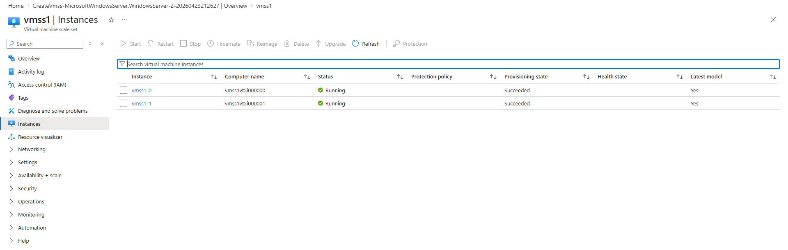

**Nota final:** Hemos configurado reglas de escalado automático para aumentar o disminuir el número de instancias según la carga de CPU, asegurando que el conjunto de escalado se mantenga dentro de los límites definidos.

---

### Tarea 5: Crear una máquina virtual con PowerShell

En esta tarea creamos una máquina virtual utilizando **Azure PowerShell** desde el Cloud Shell.

1. Usamos el ícono (arriba a la derecha) para iniciar una sesión de **Cloud Shell**. Alternativamente, navegamos directamente a [https://shell.azure.com](https://shell.azure.com).  
2. Nos aseguramos de seleccionar **PowerShell**. Si es necesario, configuramos el almacenamiento del shell.  
3. Ejecutamos el siguiente comando para crear una máquina virtual. Cuando se nos solicite, proporcionamos un nombre de usuario y contraseña para crear la cuenta de administrador local en la VM.  

   ```powershell
   New-AzVm `
   -ResourceGroupName 'az104-rg8' `
   -Name 'myPSVM' `
   -Location 'East US' `
   -Image 'Win2019Datacenter' `
   -Zone '1' `
   -Size 'Standard_D2s_v3' `
   -Credential (Get-Credential)
   ```
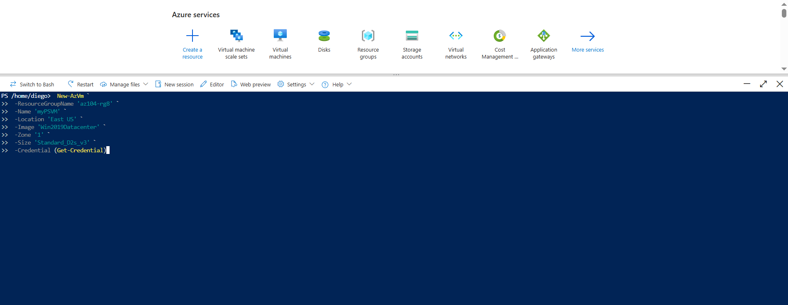
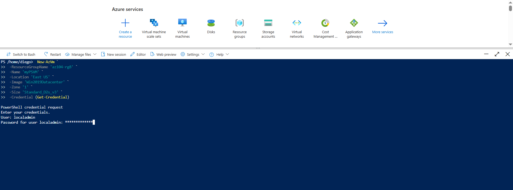
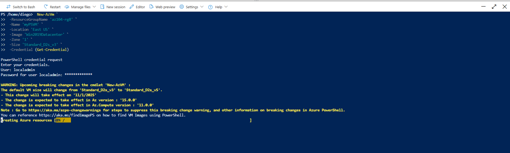
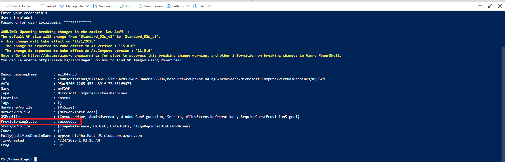

1. Una vez que el comando se complete, usamos **Get-AzVM** para listar las máquinas virtuales en nuestro grupo de recursos:  

   ```powershell
   Get-AzVM `
   -ResourceGroupName 'az104-rg8' `
   -Status
   ```
    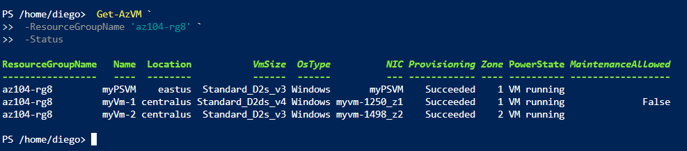

2. Verificamos que nuestra nueva máquina virtual aparezca en la lista y que el estado sea **Running**.

3. Usamos **Stop-AzVM** para desasignar nuestra máquina virtual. Escribimos **Yes** para confirmar:  

   ```powershell
   Stop-AzVM `
   -ResourceGroupName 'az104-rg8' `
   -Name 'myPSVM'
   ```
    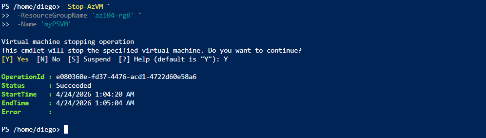

4. Usamos nuevamente **Get-AzVM** con el parámetro **-Status** para verificar que la máquina esté desasignada.
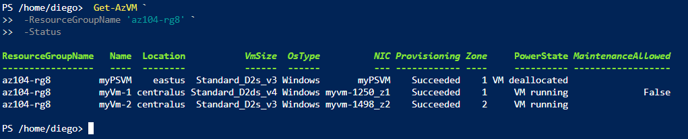

**Nota final:** Cuando detenemos una máquina virtual en Azure, su estado pasa a **deallocated**. Esto significa que cualquier dirección IP pública no estática se libera y dejamos de pagar los costos de cómputo de la VM.

---

### Tarea 6: Crear una máquina virtual con CLI

En esta tarea creamos una máquina virtual utilizando la **CLI de Azure** desde el Cloud Shell.

1. Usamos el ícono (arriba a la derecha) para iniciar una sesión de **Cloud Shell**. Alternativamente, navegamos directamente a [https://shell.azure.com](https://shell.azure.com).
2. Nos aseguramos de seleccionar **Bash**. Si es necesario, configuramos el almacenamiento del shell.
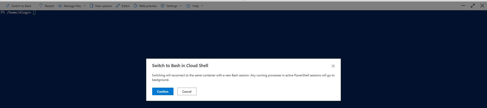

3. Ejecutamos el siguiente comando para crear una máquina virtual. Mientras esperamos, revisamos la referencia del comando `az vm create` para conocer todos los parámetros disponibles:

   ```bash
   az vm create --name myCLIVM --resource-group az104-rg8 --image Canonical:0001-com-ubuntu-server-jammy:22_04-lts:latest --admin-username localadmin --generate-ssh-keys --size Standard_D2s_v3 --location eastus
   ```
    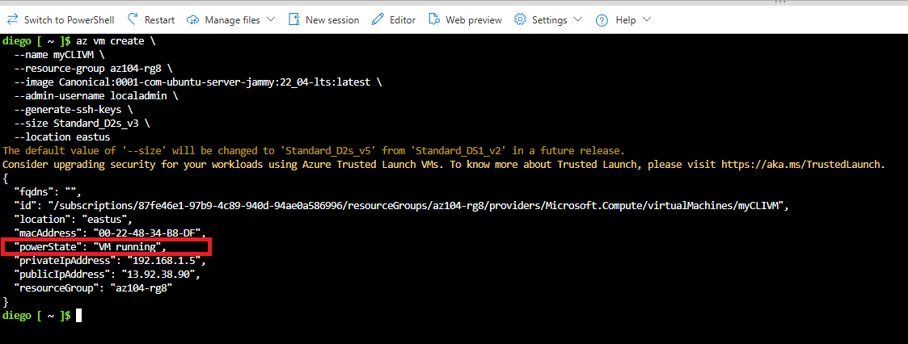

> NOTA:
>
> Si el tamaño no se encuentra disponible en la región seleccionada, habrá que reemplazar la zona de disponibilidad por otra.

1. Una vez que el comando se complete, usamos **az vm show** para verificar que la máquina se haya creado:  

   ```bash
   az vm show --name myCLIVM --resource-group az104-rg8 --show-details --output table
   ```
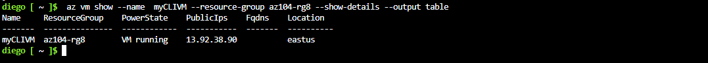

2. Verificamos que el **powerState** sea **VM Running**.  
3. Usamos **az vm deallocate** para desasignar nuestra máquina virtual. Escribimos **Yes** para confirmar:  

   ```bash
   az vm deallocate --resource-group az104-rg8 --name myCLIVM
   ```

4. Usamos nuevamente **az vm show** para asegurarnos de que el **powerState** sea **VM deallocated**.  
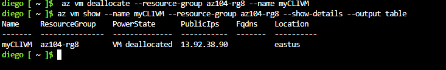

**Nota final:** Cuando detenemos una máquina virtual en Azure, su estado pasa a **deallocated**. Esto significa que cualquier dirección IP pública no estática se libera y dejamos de pagar los costos de cómputo de la VM.

---

## Conceptos reforzados

- Diferencia entre **escalado vertical** (SKU/discos) y **escalado horizontal** (VMSS).  
- Uso de **Availability Zones** para alta disponibilidad.  
- Configuración de **autoscaling basado en métricas**.  
- Automatización con PowerShell y CLI.  

---

## Resultados esperados

- VMs resilientes desplegadas en múltiples zonas.  
- VM escalada verticalmente con discos optimizados.  
- VMSS configurado con balanceador y reglas de autoscaling.  
- Validación de despliegues mediante PowerShell y CLI.  

---

## Limpieza de recursos

- Eliminar el **grupo de recursos** para liberar costos:  
  - Portal: *Delete resource group*.  
  - PowerShell: `Remove-AzResourceGroup -Name az104-rg8`.  
  - CLI: `az group delete --name az104-rg8`.  

---

## Contribuciones

Este documento fue adaptado y traducido al español para fines de estudio del AZ-104. Se aceptan mejoras en la redacción, diagramas y ejemplos prácticos

---

## Licencia

Este laboratorio se distribuye bajo la licencia MIT. Puedes usarlo, modificarlo y compartirlo libremente, siempre citando la fuente original
